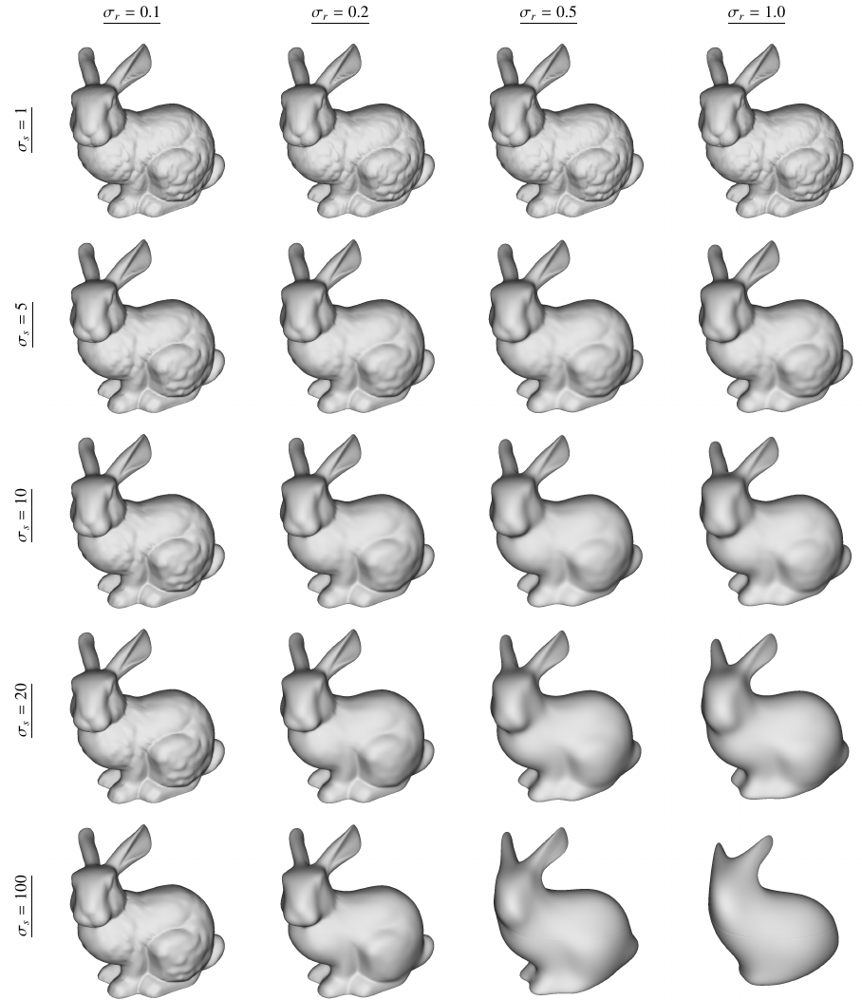

# dt-sgim

## Overview

Implementation of the DT-SGIM filter, published in *Domain transform for spherical geometry images* [1].

The DT-SGIM filter acts on polygonal meshes represented by [Geometry Images](http://hhoppe.com/proj/gim/) obtained from [spherical parametrization](http://hhoppe.com/proj/sphereparam/). As a result, the filter provides a smoothed mesh, while keeping its important curvatures.



## Compile

### Linux

You need the dependencies: gcc, g++, make, GLFW, GLEW, libgl, libpng-dev and zlib-dev.

To compile simply run:

```bash
$ make
```

and the binary `bin/gimmesh` will be created.

### OS X

You need the dependencies: gcc, g++, make, GLFW, GLEW and the OpenGL framework.

To compile simply run:

```bash
$ make
```

and the binary `bin/gimmesh` will be created.

## Usage

To use this tool, you must provide a geometry image. They are represented as `.gim` files with the following format, in order:

- Image Width: 4-bytes integer
- Image Height: 4-bytes integer
- Image Data: each pixel is represented as a 3-channel 4-byte float (RGB), totalizing 12 bytes per pixel. Total data size is (width * height * 3 (channels) * 4) bytes.


A set of example geometry images are available in the res/ folder.

To open the application, simply run:

```bash
$ ./bin/gimmesh -g <example.gim>
```

An iterative GUI will be opened and you will be able to filter the geometry image.

## Wavefront Objects

It is also possible to transform wavefront objects to the `.gim` format using the application.

To do that, simply run:

```bash
./bin/gimmesh -o <example.obj>
```

You can also set the optional parameters:

```
-e <result.gim>	: specify the path of the geometry image that will be generated (default: ./export.gim)
-it <number>	: number of iterations for spherical parametrization algorithm (default: 500)
-s <number>	: size of geometry image (<n> x <n>) [must be an odd number] (default: 255)
```

> Note: The parametrization used to transform meshes to geometry images still needs to be improved. Thus, the quality of the result will depend on the input mesh.


## References

- [1] https://www.sciencedirect.com/science/article/abs/pii/S0097849320301503.
